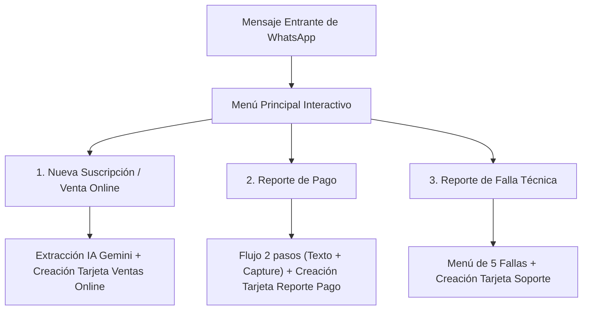

# 📑 DOCUMENTO DE CONTEXTO Y ARQUITECTURA: BOT WHATSAPP CLOUD API + IA (GEMINI)

**Propósito:** Especificación técnica, flujos conversacionales, interacción con Meta Cloud API y lógica de base de datos del bot de atención y recepción de clientes de **Metricall** para empresas de telecomunicaciones (ISPs / Fibex Telecom).

---

## 1. Stack Tecnológico y Reglas de Código (AGENTS.md)

* **Stack:** Expo SDK 57 (React Native 0.86) · Vercel Serverless Functions (`/api`) · Node.js 20 · TypeScript strict · Supabase (PostgreSQL + RLS + RPC `SECURITY DEFINER`) · Google Gemini AI (2.0 Flash / 3.5 Flash Lite) · Meta WhatsApp Cloud API.
* **Límite de 350 líneas por archivo (OBLIGATORIO):** Ningún archivo `.ts`, `.tsx` o `.js` debe superar las 350 líneas. Los handlers y servicios complejos deben subdividirse en módulos independientes.
* **Cero `any`:** Strict TypeScript en toda la aplicación cliente y tipado defensivo en backend.
* **Seguridad RLS con RPCs:** Dado que el webhook de WhatsApp opera de forma no autenticada desde los servidores de Meta, la creación de tarjetas en Supabase se ejecuta mediante funciones RPC con `SECURITY DEFINER` que asocian el registro al `empresa_id` y al `creador_id` del administrador legítimo.

---

## 2. Flujos Operativos y UX en WhatsApp Cloud API

El bot cuenta con un menú principal interactivo que bifurca en 3 flujos clave:



### A. Flujo 1: Nueva Suscripción / Planes de Internet
1. El usuario solicita contratación de servicio de internet.
2. **Extracción con Gemini (`extraerDatosSuscripcion`)**:
   - Campos extraídos: `nombre`, `sector` (urbanización/zona) y `telefono` de contacto alternativo.
   - Fallback robusto en JavaScript (`extraerDatosBasicosJS`) en caso de indisponibilidad de API Key.
3. Se envía previsualización interactiva para confirmación del cliente.
4. Al confirmar, se crea la tarjeta en la columna **VENTAS ONLINE** / **VENTA** para su posterior traslado a **FACTIBILIDAD**.

### B. Flujo 2: Reporte de Pago (Cobranza en 2 Pasos)
1. Para evitar inconsistencias de red en WhatsApp al enviar texto e imagen simultáneamente, el flujo se ejecuta en **dos pasos secuenciales**:
   - **Paso 1 (Datos de Pago y Cuentas Destino)**: El bot presenta los datos de Pago Móvil oficiales de Fibex Telecom (Banco: Mercantil 0105, Teléfono: 0412-9637516, RIF: J-30818251-6, Titular: FIBEX TELECOM) y solicita que el usuario envíe los datos de la transacción en texto (Cédula de identidad / Abonado, Banco emisor, Monto pagado y Número de referencia).
   - **Paso 2 (Capture/Comprobante)**: Una vez confirmados los datos mediante botones interactivos (`[ ✅ Confirmar ]` / `[ ❌ Corregir ]`), el bot solicita la foto del comprobante.
2. **Subida a Storage**: La imagen se descarga de los servidores de Meta y se almacena en el bucket público de Supabase Storage (`evidencias-bot`).
3. **Registro en Kanban**: Se genera la tarjeta en la lista **REPORTE PAGO** / **COBRANZA** con el badge `PAGO EN REVISIÓN` y la evidencia adjunta para auditoría humana del analista de cobranzas.

### C. Flujo 3: Reporte de Falla Técnica (Soporte NOC)
1. El bot despliega un menú interactivo nativo de WhatsApp con 5 tipos de falla tipificados:
   - `🔴 Luz roja en equipo` (`falla_luz_roja` - desconexión óptica / corte de fibra).
   - `📶 Intermitencia de servicio` (`falla_intermitencia`).
   - `🐌 Internet lento` (`falla_lento`).
   - `🚫 No abren algunas páginas` (`falla_paginas`).
   - `📵 No recibe datos` (`falla_sin_datos`).
2. Se solicitan datos del titular (Cédula y número de suscriptor si aplica).
3. Se crea automáticamente la tarjeta en el tablero de **Atención de Fallas** para diagnóstico del soporte técnico.

---

## 3. Extracción de Datos con IA (Google Gemini) y Fallbacks

* **Modelo:** `gemini-2.0-flash` vía API REST de Google Generative Language.
* **Control de Temperatura:** 0.1 a 0.2 para respuestas deterministicas en formato JSON estricto sin delimitadores markdown adicionales.
* **Fallback Local:** Si `GEMINI_API_KEY` falla o no está presente, las funciones de extracción aplican expresiones regulares y lógica posicional heurística para garantizar que ningún cliente quede desatendido.

---

## 4. Auditoría y Monitoreo en Tiempo Real (`webhook_logs`)

* Toda interacción entrante, mensaje saliente, pulsación de botón, error de API y payload crudo de Meta se almacena en la tabla `webhook_logs`.
* Los administradores supervisan esta actividad en tiempo real desde la pestaña **WhatsApp** en la interfaz móvil/web de Metricall con filtros por color y tipo de evento.

---

## 5. Configuración de Meta Cloud API y Variables de Entorno

```env
# Meta WhatsApp Cloud API
WHATSAPP_PHONE_NUMBER_ID=1327272020463323
WHATSAPP_WABA_ID=2044205619545598
WHATSAPP_ACCESS_TOKEN=tu_system_user_token_permanente
WHATSAPP_VERIFY_TOKEN=tu_verify_token_secreto
WHATSAPP_APP_SECRET=tu_app_secret_de_meta

# Google Gemini
GEMINI_API_KEY=tu_gemini_api_key
```

### Optimización de Costos
* **Meta Cloud API:** Primeras 1,000 conversaciones mensuales de servicio iniciadas por el usuario son gratuitas.
* **Google Gemini:** Nivel gratuito de hasta 1,500 peticiones diarias gratuitas (costo \$0.00 USD para operaciones estándar).

